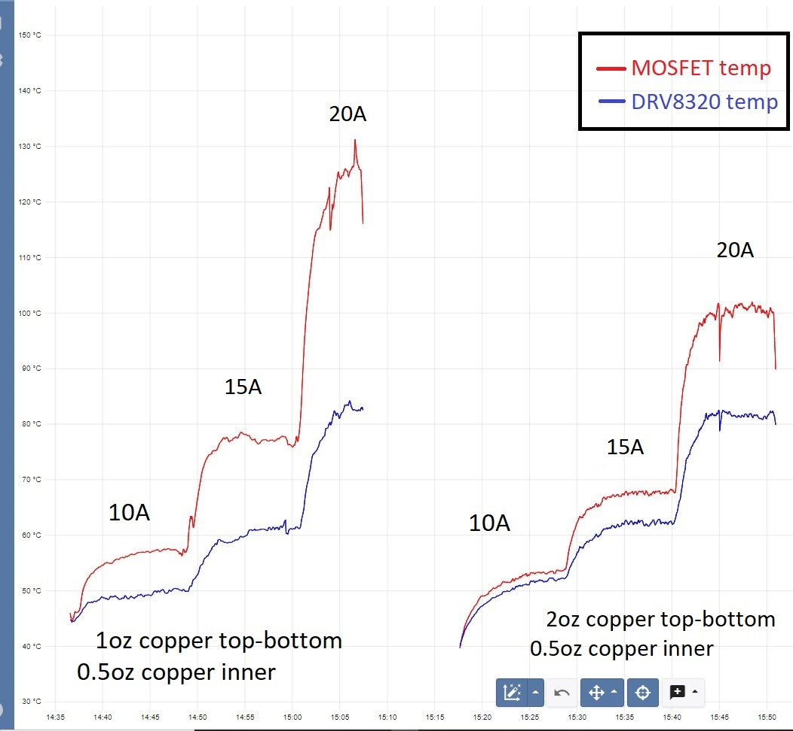

# *Simple**FOC*** ***Drive**Shield* *v1.2*

 
<!--   -->

This is an open-source low-cost BLDC driver boards in the form of a Arduino shield. It is a part of the *Simple**FOC*** project. The board is the big brother of the *Simple**FOC**Shield* and is designed to drive motors with higher current requirements, up to 30Amps. The board is created with the same philosophy as the *Simple**FOC**Shield* - to be simple to use, low-cost, and open-source and fully compatible with the *Simple**FOC***library. 

Additionally the aim of the board is to serve as a template project for the community to build their own motor drivers. 
- The board is relatively simple and can be easily modified to fit different requirements.
- The board is designed in EasyEDA and all the fabrication files are available for download

### Features
- **Plug & play**: In combination with Arduino *Simple**FOC**library* - [github](https://github.com/simplefoc/Arduino-FOC)
- **In-line current sensing**: 30Amps bidirectional
   - ACS712 hall current sensor
- **Absolute max ratings** 
   - Max current: 30A, 
   - Max input voltage: 35V
- **Stackable**: running 2 motors in the same time
- **Encoder/Hall sensors interface**: Integrated 3.3kΩ pullups (configurable)
- **I2C interface**: Integrated 4.7kΩ pullups (configurable)
- **Configurable pinout**: Hardware configuration - soldering connections
- **Arduino headers**: Arduino UNO, Arduino MEGA, STM32 Nucleo boards...
- **Open Source**: 
   - Fully designed in **EasyEDA**: [EasyEDA project](https://oshwlab.com/the.skuric/SimpleFOC-Drive)
   - Fully available fabrication files - [how to make it yourself](https://docs.simplefoc.com/arduino_simplefoc_shield_fabrication)
- **Low-cost**: Estimated price of 25-40€ - *Will be available in the SimpleFOC shop*

## Shield version comparison

Feature | SimpleFOCShield v1.x | SimpleFOCShield v2.x | SimpleFOCShield v3.x | SimpleFOC <b>Drive</b>Shield v1.x
|-|-|-|-|-|
|||||
**PWM Driver** | [L6234](https://www.st.com/resource/en/datasheet/l6234.pdf) | [L6234](https://www.st.com/resource/en/datasheet/l6234.pdf) | [DRV8313](https://www.ti.com/lit/ds/symlink/drv8313.pdf?ts=1719165774986&ref_url=https%253A%252F%252Fwww.google.com%252F)| gate driver: [DRV8320H](https://www.ti.com/lit/ds/symlink/drv8320.pdf)   mosfets: [BSZ0904NSI](https://www.infineon.com/dgdl/Infineon-BSZ0904NSI-DataSheet-v02_04-EN.pdf?fileId=db3a30432f29829e012f2a1ec7d90032)
**Current Sense** | ❌ | [INA240](https://www.ti.com/lit/ds/symlink/ina240.pdf?ts=1719180172738) | [ACS712 (5A)](https://www.allegromicro.com/en/products/sense/current-sensor-ics/zero-to-fifty-amp-integrated-conductor-sensor-ics/acs712) | [ACS712 (30A)](https://www.allegromicro.com/en/products/sense/current-sensor-ics/zero-to-fifty-amp-integrated-conductor-sensor-ics/acs712)
**Current measurement range** | ❌ | (configurable) ±3.3/5Amps | ±5Amps | ±30Amps
**Onboard LDO** | ❌ | LM7808 | LM7808 | ❌
**Stackable** | ✔️ | ✔️ | ✔️ | ✔️
**Max current** | 2Amps (5Amp peak) | 2Amps (5Amp peak) | 2Amps (3Amp peak) | 20Amps (30Amp peak)
**Max voltage** | 24V | 35V | 35V | 35V 
**Protections** | Overtemperature | Overtemperature | Overtemperature, Overcurrent | Overcurrent
**Footprint** | 68mm x 53 mm | 68mm x 53 mm | 56mm x 53mm | 56mm x 53mm
**Design tool** | Altium Designer 2019 | Altium Designer 2019 | EasyEDA | EasyEDA 

## Board evolution timeline

To check the release timeline, click [here](https://github.com/simplefoc/SimpleFOC-driveShield/releases) 

Version  | release | Release date | Comment
----- | ----- | ---- | ----
*Simple**FOC** **Drive**Shield* v1.0 | v0.1 | 05/24 | - Test version   - **DRV8300** gate driver   - **SE3082G** dual mosfets   - ACS712 (range +-30Amps)   - 20V max voltage 
*Simple**FOC** **Drive**Shield* v1.0 | v1.0 | 06/24 | - Transition to **DRV8320H** gate driver    - 30V max voltage
*Simple**FOC** **Drive**Shield* v1.1 | v1.1 | 07/24 | - Transition to 3x3mm **BSZ09x** mosfets instead of **SE3082G**   - 35V max voltage
*Simple**FOC** **Drive**Shield* v1.2 | v1.2 | 08/24 | Initial release  - Transition to **4 layer** PCB   - Enabling stacking (soldering pads)   - Configurable pullups (I2C and encoder) 

## Size comparison with SimpleFOCShield v3

## Temperature characteristics

For higher currents especially in the range of 20-30Amps the board can get quite hot. Depending on the copper thickness of the PCB chosen when ordering the board the temperature can vary, as well as the cooling conditions. The board can be fitted with a heatsink to improve the thermal performance.

The following table shows the temperature rise of the board for different current levels. The measurements were done in a controlled environment with a constant ambient temperature of 25°C. The board was powered with 24V and the current was set to the desired level using the *Simple**FOC***library. The temperature was measured on the top of the board on the DRV8320H gate driver and the BSZ0904NSI mosfets. The temperature is measured with a PICOLOG TC-08 thermocouple data logger. 

Two copper thicknesses were tested
1. Standard 4-layer: 
    - **1oz** (35um) copper thickness on top and bottom layers, 
    - **0.5oz** (17.5um) copper thickness on inner layers
2. Thick 4-layer: 
    - **2oz** (70um) copper thickness on top and bottom layers, 
    - **0.5oz** (35um) copper thickness on inner layers 

Current [A] | Standard 4-layer MOSFETS | Thick 4-layer  MOSFETS | Standard 4-layer DRV8320 |  Thick 4-layer DRV8320 
--- | --- | ---| --- | ---
10 | 57°C| 53°C | 50°C  | 52°C
20 | 78°C | 68°C| 62°C  | 62°C
30 | 125°C  | 100°C | 82°C | 82°C

As the **BSZ0904NSI** mosfets are rated for temperatures up to 150°C and the **DRV8320H** gate driver up to 125°C the board can be used up to 30Amps without additional cooling. 

**However, we strongly recommend using a heatsink or a thicker copper PCB (2oz top and bottom layers) for currents above 20Amps continuous.**

Check more details about the experiment

### Measured temperatures during the experiment

### Standard 4-layer PCB (1oz top and bottom, 0.5oz inner layers)

### Thick 4-layer PCB (2oz top and bottom, 0.5oz inner layers)

